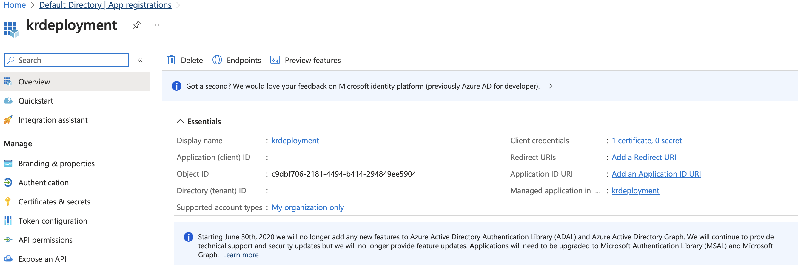
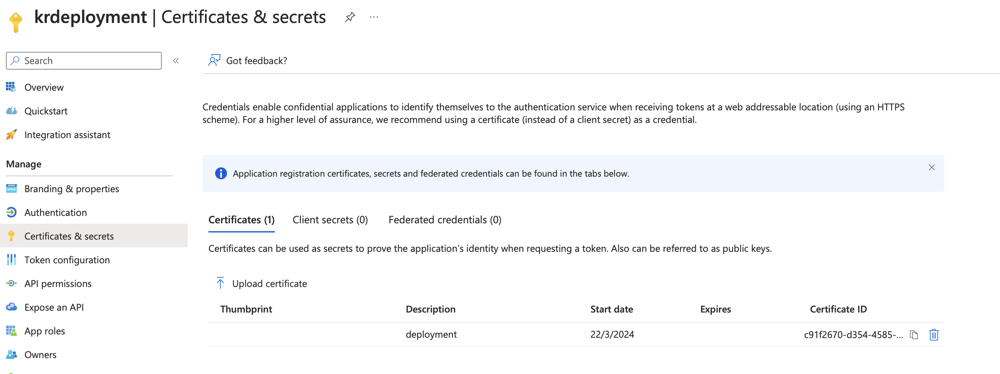
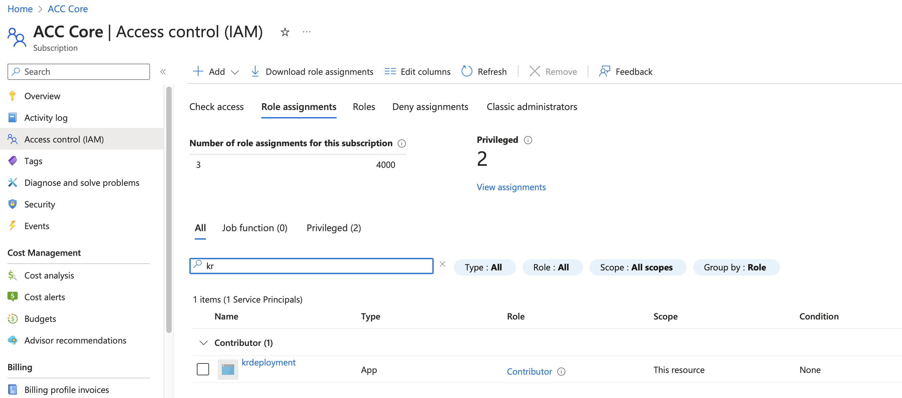

# Krypton Enterprise IAC

## Create a App registration in Azure AD

### STEP 1:  Create an app registration in azure AD


### STEP 2:  Create a self signed certificate  - terraform supports old Linux pkcs12 (frustrating as its SHA1)

### STEP 3:  Upload certificate to App-Registration.


### STEP 4:  Link subscription to APP-Registration with desired RBAC permissions.


### STEP 4: Setup API permissions for App - required for K8 Cluster admin group (RBAC)


### Populate Variables specfic to project after registring application in Azure AD and linking SP to subscription
```
AZ_CLIENT_ID='0000000-0000-0000-0000-000000000000'
AZ_CERT_PATH='/certpath/cert.pfx'
AZ_CERT_PASSWORD='CERTPASSWORD'
AZ_TENNENT_ID='0000000-0000-0000-0000-000000000000'
AZ_SUBSCRIPTION='20000000-0000-0000-0000-000000000000'
```
